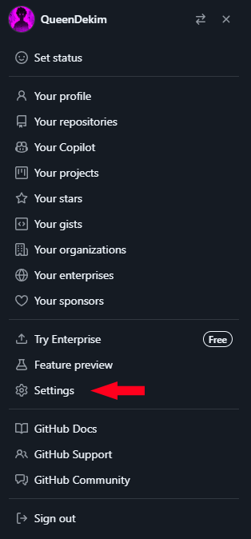
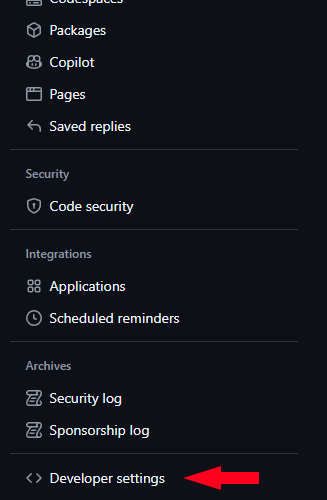
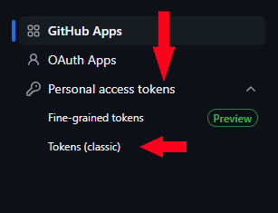
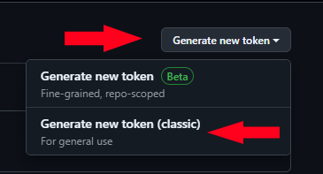
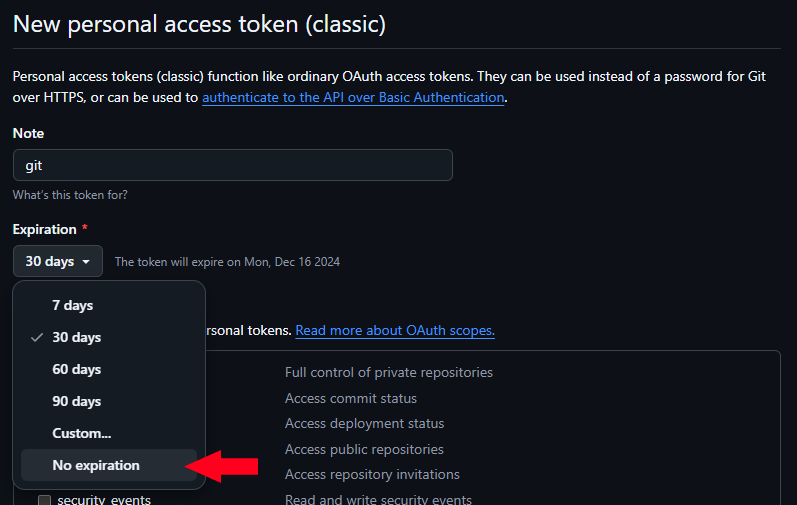
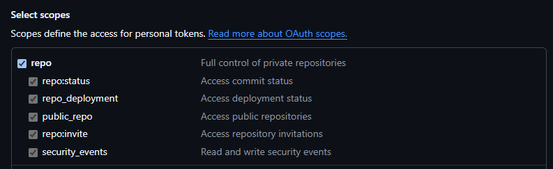
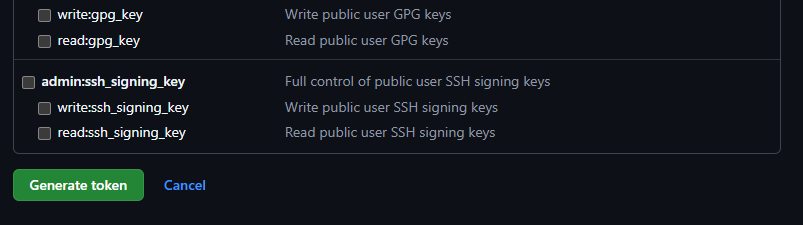
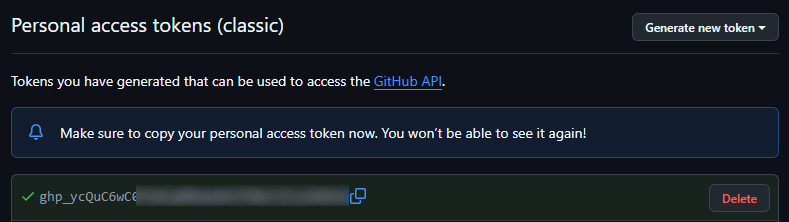

# Git-Base

---

### Настройка git:

- `git config --global user.name "Имя пользователя"` - установка имени пользователя
- `git config --global user.email "Электронная почта"` - установка электронной почты
- `git config --global core.editor "nano"` - установка редактора по умолчанию (например, для использования `VSCode` вместо `nano` надо написать `code --wait`)

---

### Создание локального репозитория:

- Создадим директорию в которой будет находится наш **локальный** репозиторий:
    ```shell
    mkdir repo-name     # создаем директорию (вместо repo-name - любое имя)
    cd repo-name        # переходим в созданную директорию
    ```

- Инициализируем репозиторий командой:
    ```shell
    git init

    # Получим следующий вывод:
    Initialized empty Git repository in /path/to/repo-dir/repo-name/.git/
    ```
    Теперь, когда репозиторий инициализирован, мы можем начать добавлять файлы

- Добавим файлы в репозиторий:
    ```shell
    echo Hello World>README.md
    ```
- Проверим статус репозитория:
    ```shell
    git status

    # Получим следующий вывод:
    On branch main

    No commits yet

    Untracked files:
        (use "git add <file>..." to include in what will be committed)
            README.md

    nothing added to commit but untracked files present (use "git add" to track)
    ```
    Новый файл `README.md` не добавлен в индекс, поэтому он отображается как неотслеживаемый файл.

- Добавим файл в индекс:
    ```shell
    git add README.md
    ```

- Снова проверим статус репозитория:
    ```shell
    git status

    # Получим следующий вывод:
    On branch main

    No commits yet

    Changes to be committed:
        (use "git rm --cached <file>..." to unstage)
            new file:   README.md
    ```

- Теперь, когда файл добавлен в индекс, мы можем создать коммит:
    ```shell
    git commit -m "Initial commit"

    # Получим следующий вывод:
    [main (root-commit) 8e27e93] Initial commit
     1 file changed, 1 insertion(+)
     create mode 100644 README.md
    ```

- Проверим историю коммитов:
    ```shell
    git log

    # Получим следующий вывод:
    commit 8e27e937055d8ce0ced4faa4e956fbff451e9118 (HEAD -> main)
    Author: user <user@example.ru>
    Date:   Sat Nov 16 14:03:51 2024 +0300

        Initial commit
    ```

- Теперь мы можем создать новую ветку и переключиться на нее:
    ```shell
    git branch feature/new-feature      # создаем новую ветку
    git checkout feature/new-feature    # переключаемся на новую ветку
    ```

- Проверим текущую ветку:
    ```shell
    git branch -a

    # Получим следующий вывод:
    * feature/new-feature
    main
    ```

- Теперь мы можем создать новый файл и добавить его в индекс:
    ```shell
    echo "Hello, world!" > new_file.txt
    git add new_file.txt
    ```
    Сразу проверим статус репозитория:
    ```shell
    git status
    
    # Получим следующий вывод:
    On branch feature/new-feature
    Changes to be committed:
        (use "git restore --staged <file>..." to unstage)
            new file:   new_file.txt
    ```

- Теперь мы можем сделать коммит:
    ```shell
    git commit -m "Added new file"
    # Получим примерно такой же вывод как и в прошлом коммите
    ```
    
- Проверим историю коммитов:
    ```shell
    git log

    # Получим следующий вывод:
    commit 89389a7e9f61585a432d4af645c67f4199c8189c (HEAD -> feature/new-feature)
    Author: user <user@example.ru>
    Date:   Sat Nov 16 14:09:23 2024 +0300

        Added new file

    commit 8e27e937055d8ce0ced4faa4e956fbff451e9118 (main)
    Author: user <user@example.ru>
    Date:   Sat Nov 16 14:03:51 2024 +0300

        Initial commit
    ```

- Выполним слияние веток `main` и `feature/new-feature`:
    ```shell
    git checkout main               # переключаемся на ветку main
    git merge feature/new-feature   # сливаем ветку feature/new-feature в ветку main

    # Получим следующий вывод:
    Updating 8e27e93..89389a7
    Fast-forward
     new_file.txt | 1 +
     1 file changed, 1 insertion(+)
     create mode 100644 new_file.txt
    ```
    Теперь в ветке `main` есть изменения из ветки `feature/new-feature`.

- Проверим статус репозитория:
    ```shell
    git status
    
    # Получим следующий вывод:
    on branch main
    nothing to commit, working tree clean
    ```
    После слияния ветка `main` чистая, поскольку все изменения из ветки `feature/new-feature` уже слиты в нее. Создавать коммит не нужно.

---

### Подключение удаленного репозитория GitHub:

Есть 2 способа авторизации: с помощью `SSH` или `HTTPS`.

Однако, если вы не хотите вводить пароль каждый раз при авторизации, лучше использовать `SSH`. 
Да и для авторизации по `HTTPS` не из `GitBash`, а например из `cmd`, `powershell` или `linux bash` нужно изрядно постараться, так как `GitHub` больше не поддерживает авторизацию по паролю. Однако поддерживает `Personal access token` который и нужно будет использовать вместо пароля

- Авторизация по `HTTPS`:
    - Логинимся на `github.com`, и заходим в настройки
        
        - Переходим к пункту `Developer settings`
        
        - Там выбираем `Personal access tokens` > `Tokens (classic)`
        
        - Нажимаем на кнопку `Generate new token` > `Generate new token (classic)`
        
        - Выбираем срок жизни токена (например - `no expiration`)
        
        - Настраиваем права токена (например, если вы хотите взамиодействовать только с репозиториями, выберите `repo`)
        
        - Нажимаем на кнопку `Generate token`
        
        - Скопируйте полученный токен и сохраните его
        
    - Теперь добавим удалённый репозиторий в Git:
        ```shell
        git remote add http-origin https://github.com/username/repository.git
        ```
    - Теперь отправим изменения в удаленный репозиторий:
        ```shell
        git push -u http-origin main
        ```
        `git` запросит у вас логин и пароль от учётной записи `GitHub`.
        Если появился графический интерфейс, то авторизуемся удобным вам способом (в графическом интерфейсе так же есть возможность использовать токен для авторизации).
        Если вместо интерфейса появилось приглашение ввести логин и пароль в терминале, то используйте свой логин и **токен** в качестве пароля

- Авторизация по `SSH`:
    - Заходим в Git-Bash и выполняем следующие команды (`email` и `Username` замените на свои):
        ```shell
        mkdir ssh   # создаем директорию для ключей
        cd ssh      # переходим в директорию

        ssh-keygen -t rsa -C "email@example.com" -f "Username"      # создаем ключ
        ```
        ```log
        Generating public/private rsa key pair.
        Enter passphrase for "Username" (empty for no passphrase):
        Enter same passphrase again:
        Your identification has been saved in Username
        Your public key has been saved in Username.pub
        ```
        ```shell
        eval $(ssh-agent -s)    # запускаем агент

        ssh-add /ssh/Username   # добавляем ключ в агент
        cat /ssh/Username.pub   # выводим содержимое публичного ключа
        touch config.txt        # создаем файл для конфигурации SSH
        nano config.txt         # открываем файл в nano для редактирования

        # вставляем в файл следующие строки
        Host github.com
            HostName github.com
            User git
            IdentityFile "/ssh/Username"
        # сохраняем изменения и выходим из nano
        ```
        _Если вы используете Windows, так же скопируйте файл приватного ключа в директорию 
        `%USERPROFILE%\.ssh` и добавьте в файл `%USERPROFILE%\.ssh\config`_
        ```conf
        Host github.com
            HostName github.com
            User git
            IdentityFile "C:/Users/User/.ssh/Username" # не публичный, а именно приватный ключ
        ```
        Проверяем что всё работает
        ```shell
        ssh -T git@github.com
        ```
        ```log
        The authenticity of host 'github.com (140.82.121.4)' can't be established.
        ED25519 key fingerprint is SHA256:+********************/zLDA0zPMSvHdkr4UvCOqU.
        This key is not known by any other names.
        Are you sure you want to continue connecting (yes/no/[fingerprint])? yes

        Warning: Permanently added 'github.com' (ED25519) to the list of known hosts.
        Hi Username! You've successfully authenticated, but GitHub does not provide shell access.
        ```
        Если вы получили это сообщение, то все работает правильно.

    - Теперь можем вернуться в наш репозиторий и подключить наш аккаунт `GitHub` к репозиторию:
        ```shell
        git remote add ssh-origin git@github.com:Username/Repository.git

        # Просмотреть список удаленных репозиториев можно командой
        git remote -v
        ```
    - Теперь мы можем использовать команду `git push` для отправки изменений в наш репозиторий на `GitHub`:
        ```shell
        git push ssh-origin main
        ```

---

### Клонирование Репозитория

- Чтобы клонировать репозиторий, воспользуйтесь командой `git clone`:
    ```shell
    git clone git@github.com:Username/Repository.git        # клонирование по SSH
    git clone https://github.com/Username/Repository.git    # клонирование по HTTPS
    ```
    Теперь можно вносить изменения и создавать коммиты и пуши

- Если удалённый репозиторий изменился, то вы можете обновить локальный репозиторий командой `git pull`:
    ```shell
    git pull origin main
    ```
    Или использовать `git fetch`:
    ```shell
    git fetch origin main
    ```

`git fetch` и `git pull` — это две команды в `Git`, которые используются для получения обновлений из удаленного репозитория, но они работают по-разному.

`git fetch`: Эта команда загружает изменения из удаленного репозитория (например, новые коммиты, ветки и т. д.), но не объединяет их с вашей текущей веткой. Она просто обновляет информацию о состоянии удаленных веток в вашем локальном репозитории.

**Когда использовать**: Используйте `git fetch`, когда вы хотите просмотреть изменения в удаленном репозитории, прежде чем решать, как их интегрировать в свою работу. Это позволяет вам сначала проверить, что нового появилось, и затем принимать решение о слиянии или ребейзе.

`git pull`: Эта команда выполняет две операции: сначала она выполняет `git fetch`, а затем автоматически объединяет (или "сливает") изменения из удаленной ветки с вашей текущей веткой. По умолчанию используется слияние, но можно настроить его на использование ребейза.

**Когда использовать**: Используйте `git pull`, когда вы хотите сразу получить и интегрировать изменения из удаленного репозитория в вашу текущую ветку.